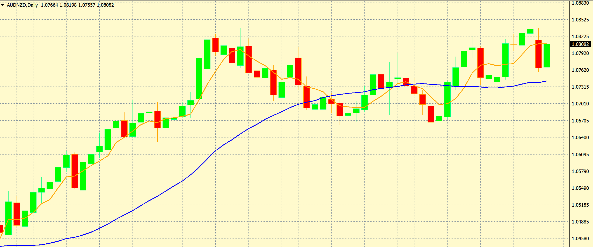

# Forex Data Modules

NOTE: This project has been repurposed from the repository *ForexModules*. It is
 currently under construction and certain sections may be unfinished.  This
  README will be updated for clarity as modules are posted and updated.
  
## Index:

### Section 1 - Introduction
### Section 2 - Trading Strategy
#### Part 2a - The Average True Range 

## Section 1 - Introduction

This is a collection of various modules that I use for procuring data relevant 
to the foreign exchange market, also known as Forex. 

Unlike stocks and futures, Forex is traded in pairs.  We buy one
currency against another currency.  For example, USD/JPY means that we are
trading the US Dollar and Japanese Yen pairing.


We can either **buy** or **sell** this pairing.  If I buy the USD/JPY, I am
 buying the US Dollar *against* the Japanese Yen.  I am betting that the US
  Dollar will appreciate in price relative to the Japanese Yen.  


Conversely, if I sell the USD/JPY pairing, I am buying the Japanese Yen
 against the US Dollar.  I am betting that the Japanese Yen will appreciate
  in price relative to the US Dollar instead.
  


Currency is traded in what is called **lots**.  A lot references the number
of currency units you are using to buy and sell currency pairs. The standard
size for a lot is 100,000 units of currency.  So as an example, if my
account was funded in US Dollars, and I wanted to buy one lot of a US Dollar
currency pair, I would need $100,000 to do so.

We can also trade in smaller lot sizes.  These are sizes that are
 traditionally available through most brokers:
 
 
  
Lot size won't impact how we develop our modules, but it may be used
 as part of risk tolerance and overall trading strategy implementations in the
  future.

  
# Section 2: Trading Strategy

The method I use to trade involves the use of **indicators**
 
Indicators are tools such graphs and statistics that gives us results we can
 use to make trading decisions.

The Simple Moving Average is an example of a very basic and effective
indicator. This calculates the average of values over a given time period
, and this time period can be customized. For example a simple moving average
of 5, or SMA(5), gives us the average of prices over the last 5 days.
An SMA(30)does the same over a 30 day period.


<H6>The daily chart of AUD/NZD with a Simple Moving Average of 5 (in orange) 
and 30 (in blue) applied to the closing price.  A smaller value for SMA binds 
closer to the points, and a larger value shows the overall trend.</H6>

In the next section, we will introduce the Average True Range, which is an
indicator I use to determine my entry size when making a trade.  We will
then explore an indicator called the Rate of Change to use as an example of
how we enter trades.
   
### Part 2a - The Average True Range

One very basic principle that every trader should use, but many don't use, is
where to **take profit** and **realize loss**.  When we trade, we set the
maximum amount of loss we are willing to endure and exit that trade with no
exceptions. We also want to set a point where we can take profit on
the trade.  

The Average True Range, or ATR, is an excellent way of determining where
 these limits lie. 
  
 The True Range returns whatever is the maximum of these three figures:
 
 - Current Day High - Current Day Low
 - Current Day High - Previous Day Close
 - Previous Day Close - Today's Low
   
We can stylistically express these like so:

 

#### Part 1a - Backtesting

Backtesting is where I analyze the history of multiple different currency
 pairs over time.  My approach relies heavily on the use of 
 **indicators**, so determining the efficacy and appropriate applications of
  these indicators via backtesting is essential to success in this system.
  
# Measuring data in MetaTrader 4
  
## How do we find this data?

MetaTrader4 is a trading platform that works in conjunction with many major
 trading platforms, including OANDA and Forex.com, two of the only brokers
  available to forex traders in the United States.  I am using OANDA's
   MetaTrader4 platform for my backtesting and extracting the data from there
    for indicator analysis. 
    
   Here is an example of an typical window in MetaTrader 4.  

   


- The Data Window: 

    This is the main window where I extract my information.  It contains the
     boilerplate information: Date, Open, High, Low, Close, and Volume.

     - The Open is the level where price was at the beginning of the day.
     - The High is the highest that price has reached that day.
     - The Low is the lowest that price has reached that day.
     - The Close is the level where price was at the end of the day
     - The Volume represents total relative trading activity that day
     
    We can also see that we have SMA(5), SMA(14) and EMA(14) listed.  This is
     our Simple Moving Average 5 and Simple Moving Average 14, and
      Exponential Moving Average 14.  This shows us that we can not only
       measure different time frames with the same indicator, but also
        include different indicators over similar time frames to measure
         their individual effectiveness.
         
- The Navigator Window:  

    This contains various indicators, both pre-installed and external, used
     for backtesting.  Double-clicking on these icons displays a window in
      which we can customize various settings, including the period measured, 
      shift, line style and line color of graph.
      
- The Chart:

    This visualizes our currency pair and indicator data represented in
     graphical format. Each individual bar represents a day, where the high
      and low points represent the High and Low respectively, the left tick
       represents the Open, and the right tick represents the Close. Green
        bars are days where the close was greater than the open, and red bars
         are days where the open was greater than the close.
         
 ## How do we collect this data?
 
A major challenge I encountered was not being able to retrieve indicator data
 in an exportable format. The History Center provides our basic boilerplate
  information, but doesn't seem to include options for including and
   calculating indicator data.  
   
   There are two ways I decided to approach this, the first via Black Box
    Testing and the second through White Box Testing.  These methods
    respectively are as follows:
   
   1. Create a module using PyAutoGUI to cycle through each bar, copy the
    data and paste it into a blank worksheet.  This is simpler and doesn't
     require excessive coding, but is very resource intensive, unintuitive
     , and does not allow for interaction at any time during the process
      unless hard-stopped with a fail safe.
      
   2. Analyze individual indicators to determine their code structure, calculate
    their values (via matplotlib, pandas, etc), and append those values back
     to some columnar data store.  This is much more tidy and customizable
     , and there are much less steps involved with transposing data in Excel
      and creating various csv files.  However it requires a greater degree
       of code, fundamental knowledge of the model, and understanding of the
        MQL5 language (similar to C++) that these modules are written in.
        
   
I decided that a mix of the two was the best approach, as I needed to collect
 some data on which to graph and build future modules. 
 
 - The first method
  resulted in module **dataScraping.py** and is located within this repository
  .  
  
  - The second method
  requires multiple different modules, as each indicator has different
   methods of calculation and therefore different code structure.  A 
    schedule of upcoming projects will be posted to this repository in the
     future.  
     
     **continuationTrade.py**, also located in this repository, is an example
      of this method and is my first attempt at writing a module dependent on
       the indicator's code.
       
As of this posting, the output of my White Box Testing module unfortunately does
 not match the output of my indicator results on MetaTrader 4.  
 
 However, it
  is clear that a two-pronged approach using both methods is necessary, as I
   need to compare my white box data against some black box data for accuracy
   , and see what margin of error (if any) is acceptable.
     
## What's next?

*Please note: This section contains various projects and ideas that will be
 heavily edited as they are added, completed or removed.  Real-life
  obligations and technological constraints may affect the timeliness of how
   these are addressed, and if so will be appended with details.*
   
- My trading algorithm follows the 
[No Nonsense Forex approach.](https://nononsenseforex.com/) This incudes six
 major components: 	
    1) ATR
	2) Baseline
	3) Confirmation Indicator
	4) Volume Indicator
	5) 2nd Confirmation Indicator
    6) Exit Indicator
    
    Each indicator that I am testing can function as one or multiple of these
     indicators, and some can function best only when used as multiple (for
      example, an Exponential Moving Average could function best as a
       Baseline **only when** it is also used as an Exit Indicator
       )  
       
     *Therefore, future modules should address these parameters and
      analyze
      not only what works best, but where it does relative to the algorithmic
       structure and to other indicators used in the algorithm.*
     
- News events impact trade entries and exits.  This structure is heavily
 trend-based, as we are looking for patterns in data to determine future
  actions. Consider the chart used in the example above:
  
  
  
  We can see an enormous red bar on January 3rd.  With no other context, we
   can only assume that either the AUD fell, the JPY rose, or both
    concurrently happened.  It is important to be contextually aware of these
     outliers when doing data analysis, as we can analyze other currency
      pairings with the same scrutiny and avoid including these outliers in
       data collection.
       
   It is important to understand that these phenomena can not always be
    explained.  The above situation is referred to as the 
    [Yen Flash Crash](https://www.cnbc.com/2019/01/03/yen-surges-against-global-currencies-after-flash-crash.html)
      and as we can see, even the experts don't have an exact reason as to
       why this particular situation occurred.
       
    *Modules should include a calendar of events where appropriate to account
     for outliers and detail the degree of influence and action taken.*
     
# Using an Entry Indicator

We will use a basic indicator to show an example of the processes we use.

Rate of Change indicator:


Now we'll start building our program:

## rateofChange.py 
### Calculating The Formula:
We will use Pandas to transform our .csv file

```buildoutcfg
import pandas as pd
from pandas import DataFrame
```

We'll have a variable called **period** so that we can adjust our n value
 easily.

```buildoutcfg
period = 5
```

Read our data in, and only extract the needed columns **date** and **close**:

```buildoutcfg
df = pd.read_csv('data/AUDNZD1440.csv', usecols=['date', 'close'])
```

To figure out the closing price p-n, we'll shift the dataframe by the number
 of periods:

```buildoutcfg
xDaysAgoPrice = df.close.shift(periods=period)
```

We'll convert the dataframes we have to lists.  This is for ease of formula
 calculation.

```buildoutcfg
dateList = df.date.tolist()
closeList = df.close.tolist()
xDayAgoList = xDaysAgoPrice.tolist()
```

We'll create a list for the rate of change values:

```buildoutcfg
rocList = []
```

And put in our formula to calculate Rate of Change:

```buildoutcfg
for x in closeList:
    for y in xDayAgoList:
        rocList.append(((x-y)/y) * 100)
```

### Identifying the ranges:

We want to find out where our entry points are and capture the range of the
 position.  

We create two empty lists.
  
```buildoutcfg
shortId, longId = [], []
for p in range(0, (period + 1)):
    shortId.append(0), longId.append(0)
```

We start with an identifier value of 1.  
We append that identifier to every value where x < 0
If x > 0, we append 0 and increment the value.
This makes it so that the next data set has a discrete identifier.

```buildoutcfg
shortIdentifier = 1
for x in rocList:
    if x < 0:
        shortId.append(shortIdentifier)
    elif x > 0:
        shortId.append(0)
        shortIdentifier += 1
```

Do the same for Long Identifier:

```buildoutcfg
longIdentifier = 1
for y in rocList:
    if y > 0:
        longId.append(longIdentifier)
    elif y < 0:
        longId.append(0)
        longIdentifier += 1
```

