# Forex Data Modules

NOTE: This project has been repurposed from the repository *ForexModules*. It is
 currently under construction and certain sections may be unfinished.  This
  README will be updated for clarity as modules are posted and updated.
  
## Index:

### Section 1 - Introduction
### Section 2 - Trading Strategy
### Section 3 - Backtesting
#### Part a - Measuring data in MetaTrader 4
#### Part b - The Data Window
#### Part c - Collecting the data 
### Section 4 - The Average True Range 
#### Part a - Overview
#### Part b - Code Walkthrough 
### Section 5 - The Rate Of Change Indicator
#### Part a - Overview
#### Part b - Code Walkthrough
#### Part c - Capturing the Ranges
### Section 6 - Parsing the IDs (In Progress)
#### Part a - Overview
#### Part b - Writing to .xlsx Code Walkthrough
#### Part c - Writing to .csv Code Walkthrough

### Appendix 
#### Upcoming Plans
#### Citations

---

## Section 1 - Introduction

This is a collection of various modules that I use for procuring data relevant 
to the foreign exchange market, also known as Forex. 

Unlike stocks and futures, Forex is traded in pairs.  We buy one
currency against another currency.  For example, USD/JPY means that we are
trading the US Dollar and Japanese Yen pairing.


We can either **buy** or **sell** this pairing.  If I buy the USD/JPY, I am
 buying the US Dollar *against* the Japanese Yen.  I am betting that the US
  Dollar will appreciate in price relative to the Japanese Yen.  


Conversely, if I sell the USD/JPY pairing, I am buying the Japanese Yen
 against the US Dollar.  I am betting that the Japanese Yen will appreciate
  in price relative to the US Dollar instead.
  


Currency is traded in **lots**.  A lot references the number
of currency units you are using to buy and sell currency pairs. The standard
size for a lot is 100,000 units of currency.  So as an example, if my
account was funded in US Dollars, and I wanted to buy one lot of a US Dollar
currency pair, I would need $100,000 to do so.

We can also trade in smaller lot sizes.  These are sizes that are
 traditionally available through most brokers:
 
 
  
Lot size won't impact how we develop our modules, but it may be used
 as part of risk tolerance and overall trading strategy implementations in the
  future.

---
  
## Section 2: Trading Strategy

The method I use to trade involves the use of **indicators**
 
Indicators are tools such graphs and statistics that gives us results we can
 use to make trading decisions.

The Simple Moving Average is an example of a very basic and effective
indicator. This calculates the average of values over a given time period
, and this time period can be customized. For example a simple moving average
of 5, or SMA(5), gives us the average of prices over the last 5 days.
An SMA(30)does the same over a 30 day period.


<H6>The daily chart of AUD/NZD with a Simple Moving Average of 5 (in orange) 
and 30 (in blue) applied to the closing price.  A smaller value for SMA binds 
closer to the points, and a larger value shows the overall trend.</H6>

So what decisions do we make with these indicators?

There are several categories that each of these indicators can fall in, but
the first indicator we will look at is our **entry indicator**.  At some
point, we will need to enter a trade, so this is a good place to start. 
 
When we look at the chart above, the SMA(5) details the prevailing longer term
trend, but is also prone to missing out on smaller movement.  We will look to
 see where the SMA(5) crosses over, and enter in the direction it is going:
 
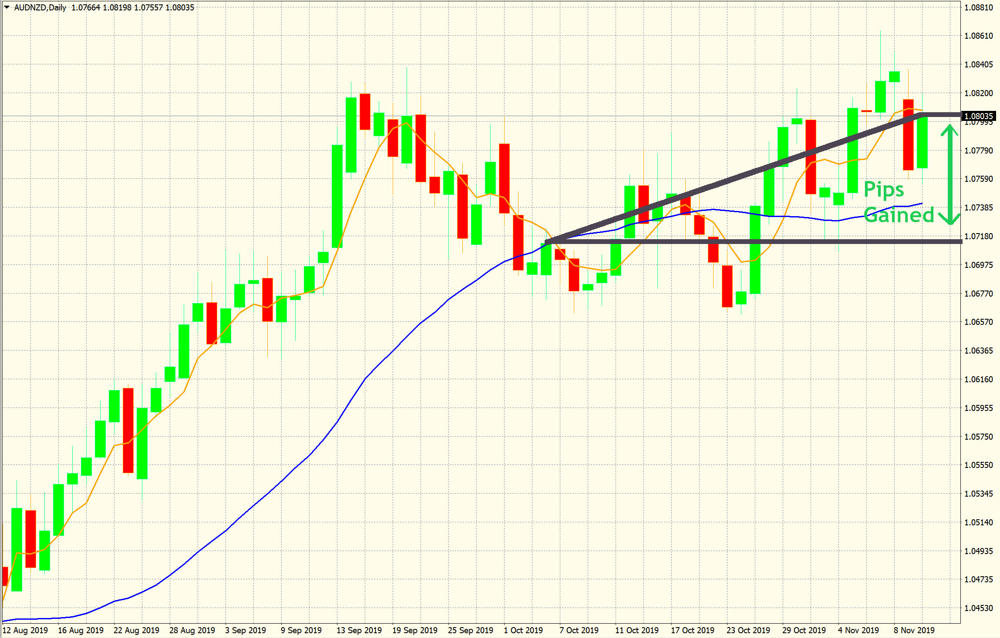

So we gained quite a bit, but it would have been nice to capture the bottom
of that range.  If we had an indicator that got us in there, we would have a
much larger gain over a much shorter time period.
  
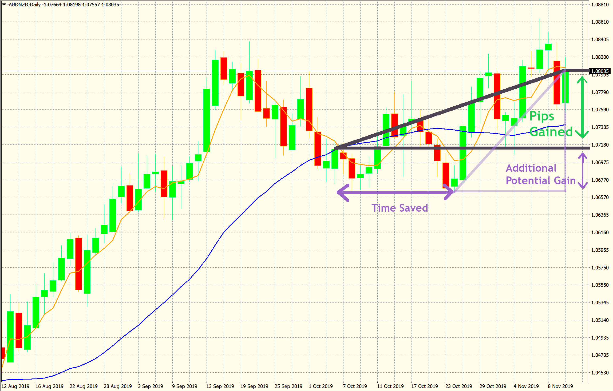

When we test our indicators, we're not looking for indicators that get
us into trades, we want indicators that get us into trades **well**.  We
need a place to start, so we'll demonstrate by using a basic indicator
called the **Rate of Change** indicator.   This isn't a great indicator
, but gives us something on which we can build our platform. Once we
build our program to extract the data from this indicator, we can add other
modules and compare them to our Rate of Change using the same template.
  
Once our entry indicator module is in place and established, we can add other
indicators to our system. For example, we can determine where to exit with
an **exit indicator**, or perhaps add a **second entry indicator** to make
sure our entries are successful.  

But first, we need to figure out how to get our data.  We will go over how I
collect data for this project, and move onto actually building our modules
for use with our indicators.

---

## Section 3 - Backtesting

Backtesting is where I analyze the history of multiple different currency
pairs over time.  My approach relies heavily on the use of 
indicators, so determining the efficacy and appropriate applications of
these indicators via backtesting is essential to success in this system.
  
### Part a - Measuring data in MetaTrader 4

MetaTrader4 is a trading platform that works in conjunction with many major
trading platforms, including OANDA and Forex.com, two of the only brokers
available to forex traders in the United States.  I am using OANDA's
MetaTrader4 platform for my backtesting and extracting the data from there
for indicator analysis. 
    
Here is an example of an typical window in MetaTrader 4.  
   


---

### Part b - The Data Window 

This is the main window where I extract my information.  It contains the
boilerplate information: Date, Open, High, Low, Close, and Volume.

- The Open is the level where price was at the beginning of the day.
- The High is the highest that price has reached that day.
- The Low is the lowest that price has reached that day.
- The Close is the level where price was at the end of the day
- The Volume represents total relative trading activity that day
     
We can also see that we have SMA(5), SMA(14) and EMA(14) listed.  This is
our Simple Moving Average 5 and Simple Moving Average 14, and
Exponential Moving Average 14.  This shows us that we can not only
measure different time frames with the same indicator, but also
include different indicators over similar time frames to measure
their individual effectiveness.
         
#### The Navigator Window  

This contains various indicators, both pre-installed and external, used
for backtesting.  Double-clicking on these icons displays a window in
which we can customize various settings, including the period measured, 
shift, line style and line color of graph.
      
#### The Chart

This visualizes our currency pair and indicator data represented in
graphical format. Each individual bar represents a day, where the high
and low points represent the High and Low respectively, the left tick
represents the Open, and the right tick represents the Close. Green
bars are days where the close was greater than the open, and red bars
are days where the open was greater than the close.

---
         
### Part c - Collecting the data
 
A major challenge I encountered was not being able to retrieve indicator data
in an exportable format. The History Center provides our basic boilerplate
information, but doesn't seem to include options for including and
calculating indicator data.  

Even if we are able to get this information, we want to compare different
values for periods to see which is more effective.  For example, if I want to
compare a range of 60 Exponential Moving Average periods , I would have to
put 60 indicators on the chart.  This is obviously very cumbersome, and
writing a program to iterate over this in a loop should be much more efficient.
   
There are two ways I decided to approach this, the first via Black Box
Testing and the second through White Box Testing.  These methods
respectively are as follows:
   
1. Create a module using PyAutoGUI to cycle through each bar, copy the
data and paste it into a blank worksheet.  This is simpler and doesn't
require excessive coding, but is very resource intensive, unintuitive
, and does not allow for interaction at any time during the process
unless hard-stopped with a fail safe.
      
2. Analyze individual indicators to determine their code structure, calculate
their values (via matplotlib, pandas, etc), and append those values back
to some columnar data store.  This is much more tidy and customizable
, and there are much less steps involved with transposing data in Excel
and creating various csv files.  However it requires a greater degree
of code, fundamental knowledge of the model, and understanding of the
MQL5 language (similar to C++) that these modules are written in.       
   
Method #1 works better for initially testing indicators.  For example, if a
new indicator is released, it may be best to gather some data to gauge its
effectiveness.  If it is something I can utilize, I can then develop the
code based on the indicator for further testing.  
 
- The first method resulted in module **dataScraping.py** and is located
within this repository (modules/autogui/dataScraping.py)  
  
- The second method requires multiple different modules, as each indicator has
different methods of calculation and therefore different code structure.  A 
schedule of upcoming projects will be posted to this repository in the
future.  
     
**continuationTrade.py**, also located in this repository, is an example
of this method and is my first attempt at writing a module dependent on
the indicator's code.
       
In the next section, we will introduce the Average True Range, which is an
indicator I use to determine my entry size when making a trade.  We will
then explore an indicator called the Rate of Change to use as an example of
how we enter trades.

---

### Section 4 - The Average True Range

#### Part a - Overview

One very basic principle that every trader should use, but many don't use, is
where to **take profit** and **realize loss**.  When we trade, we set the
maximum amount of loss we are willing to endure and exit that trade with no
exceptions. We also want to set a point where we can take profit on
the trade.  

The Average True Range, or ATR, is an excellent way of determining where
 these limits lie. 
  
 The True Range returns whatever is the maximum of these three figures:
 
 - Current Day High - Current Day Low
 - Current Day High - Previous Day Close
 - Previous Day Close - Today's Low
   
We can stylistically express these like so:


The **Average** True Range simply takes the average of these calculated True
 Ranges for a given time period.
 


So why are we using the ATR?  

The ATR effectively encapsulates the magnitude of price movement within a
given period.  If we measure just the close between two days, we may not see
where price really went.  Think of a stock that starts the day at $100, and
closes at $101.  It may have gone up all the way to $110, but since we
never measured that high, we didn't incorporate that movement into our
overall trading strategy.  Because we capture these ranges over a given time
period, and average them to smooth out any possible outliers, we get a good
view of **how far** price is likely to move.

When we make a trade, we will use the value of the ATR to determine where to
put our stop loss and take profit targets.  Lets say I want to put my stop
loss and take profit targets at *1 x ATR*. If I enter a trade **long** on AUD/NZD at 10,766 and my ATR value is 56, I would set my stop loss at 10,710 and my
take profit at 10,822.

The multiplier for ATR can be adjusted as indicators are tested.  If our
trades are getting stopped out too soon, where our trade went to 10,766 but
went up past 10,822, we may want to adjust our stop loss to let the trade
breathe.  Of course, adjustments need to be made to our risk tolerance
portfolio whenever we decide to change these parameters.
 
When we start backtesting our data, our ATR parameters will be important.  We
want to determine what constitutes a winning trade and losing trade, and
this all depends on where we get stopped out or make profit.  

---

#### Part b - Code Walkthrough

The code for this file can be found in modules/averageTrueRange.py

We will use the Pandas library for most of the modules in this
 repository.
 
Import Pandas, and read in our data.  For testing, I use the Oanda platform's
 data center to obtain csv files with relevant information.  If using this
  module, be sure to adjust as necessary to meet your needs. 


Calculate the max values by assigning each of them into DataFrames:


and finding the max for each:


We use .mean on this new DataFrame to find the Average True range, and
pass the .rolling method in pandas to adjust our period.


Before exporting, I included a DataFrame for 'pipgain' that calculates the
daily pip difference to export with the ATR DataFrame.  This is useful when
calculating for total gain and loss, and inclusion is optional.


The full code is as follows:


---

### Section 5 - The Rate Of Change Indicator

#### Part a - Overview

Now that we have our ATR, we can start importing this indicator along with the
information we have for our currency pairs into other modules for testing.  

The Rate of Change as mentioned before is not necessarily a great indicator to
use for our entry signals, but is basic enough to demonstrate an example of
the process of determining trade entries and give us a good starting point to
test our other entry indicators against.

We use the rate of change as a **zero-cross** indicator.  What this means is
that when the value of the Rate of Change goes from positive to negative, or
negative to positive (crosses zero), that is our signal to enter the trade.

This is the formula for Rate of Change:


Let's start building our program.

---

#### Part b - Code Walkthrough

We will use Pandas to transform our .csv file

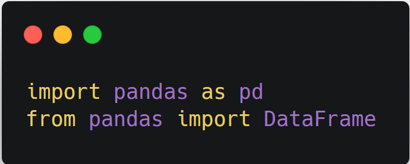

We'll have a variable called **period** so that we can adjust our n value
 easily.
 
While here, we also provide our ATR value.  When collecting the data at the
end, we want to remove columns that don't have an ATR value because they are
outside of the range. For example, with an ATR of 14, our first 14 columns
won't have an ATR because we don't have 14 previous days of information

#####This section may be incorporated into averageTrueRange.py module in future releases for flexibility with other indicator modules)

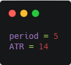


Read our data in, and only extract the needed columns **date** and **close**:

```
df = pd.read_csv('data/AUDNZD1440.csv', usecols=['date', 'close'])
```

To figure out the closing price p-n, we'll create a DataFrame *pastPrice
* that shifts the price by the value of period that we defined above

```
df['pastPrice'] = df['close'].shift(periods=period)
```

We implement our rate of change formula in a new DataFrame.


```
df['roc'] = ((df['close'] - df['pastPrice']) / df['pastPrice']) * 100
```

#### Part c - Capturing the Ranges:

We want to find out where our entry points are and capture the range of the
position.  

We can find our entry points by seeing where the signal flipped from positive
to negative.  We will look at where the signal was on the previous day, and
compare that to the signal on the current day.  If the signal flipped, we
give it a unique ID number. The next section where the signal flips gets a
new ID number, so that we can discern where a new signal comes in.

First, lets create our previous day DataFrame, called 'shift'.

df['shift'] = df['roc'].shift(periods=1)

We'll create two empty lists determining where each value is positive

```
rocIsPositive = []
shiftIsPositive = []
```

And create two loops that will analyze each value of both of our DataFrames,
and return a True or False boolean

```
for x in df['roc']:
    if x > 0:
        rocIsPositive.append(True)
    else:
        rocIsPositive.append(False)

for y in df['shift']:
    if y > 0:
        shiftIsPositive.append(True)
    else:
        shiftIsPositive.append(False)
``` 
Now we need to create our discrete identifiers.

Lets create a list for our Ids to which our loop can return values.

```
idList = []
```

We will start with an identifier value of 1.

```
identifier = 1
```

Next, we create our loop.  If the previous day signal is negative and the
current day is positive, or vice versa, that means our signal crossed zero
and this is an entry point.  This signals a new entry and therefore we need to
increment the value to reflect the new section we are analyzing.
   
```
for z in range(0, len(rocIsPositive)):
    if rocIsPositive[z] != shiftIsPositive[z]:
        idList.append(identifier)
        identifier += 1
    else:
        idList.append(identifier)
```

We save the data in the list to a DataFrame:

```
df['id'] = DataFrame(idList)
```

and drop the index of our ATR value   

```
df = df.drop(df.index[0:(ATR-1)])
```

Call our export function:

```
df.to_csv(r'C:\GithubProjects\Indicators\output\test.csv',
          columns=['date', 'close', 'ATR', 'pipGain', 'roc', 'id'])
```       
          
And our output looks like this:


Looking at the data, it does seem that our ID's are one row late, as seen below:


This is a good time to explain how we trade: 

The indicator must cross zero **and close** across zero.  Forex is a 24
hour market and is traded in sessions.  The close of a candle is really the
close of the New York Session, which runs from 8AM to 5PM EST. But as soon as
that New York Session ends, a new candle opens as  the Sydney session begins
and runs from 5PM EST to 2AM EST, which then goes through the Tokyo and
London sessions before resuming on New York.
  
Unlike stocks, which have a defined close and open (including premarket and
aftermarket hourse), Forex is constant through the 5 day week.  If a signal
crosses 0 and we make a trade on the same day, the signal could still flip
the other way. 
   
Therefore, we look at the negative or positive attribute of the previous
day's value, and enter **if and only if** the current day attribute is the
same.

For example, if yesterday's ROC value is -1.2 and today's is -2.1, that is my 
signal to enter the trade. If today's value attribute is positive, we do not
enter.
 
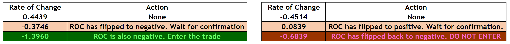

Our next objective will be finding a method to divide these sections up by
 their ID number to determine our gain and loss.
 
---
 
### Section 6 - Parsing the IDs (In Progress)

#### Part a - Overview

Parsing the IDs can be a little tricky.  Having files in a .csv format keeps
it all on one sheet, and tends to be more flexible as comma separation is a
very simple method of separating our values from each other.  
  
However, we're going to have quite a bit of information, and the column count
is going to vastly increase.  Suppose our parser returns 30 separate entry
instances.  We now have 30 columns labeled 'close', 'ATR', etc. and our
programs may be confused on which columns to operate.
   
Using ExcelWriter in Pandas, we can have the option of saving this file to an
.xlsx extension.  This separates all instances in separate worksheets.  We
will include a method for saving .csv files and a method for .xlsx files
, where the user can simply comment out the section they need, or in later
implementations, the front-end interface will provide an option to export
in either extension and our program will run the appropriate code.
    
#### Part b - Writing to .xlsx Code Walkthrough

We will start by importing the pandas and ExcelWriter modules

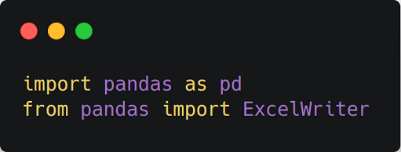

We're going to include a section where we can put the maximum amount of
 entries (IDs) we want our program to return, and paths for our input and
  output.
 
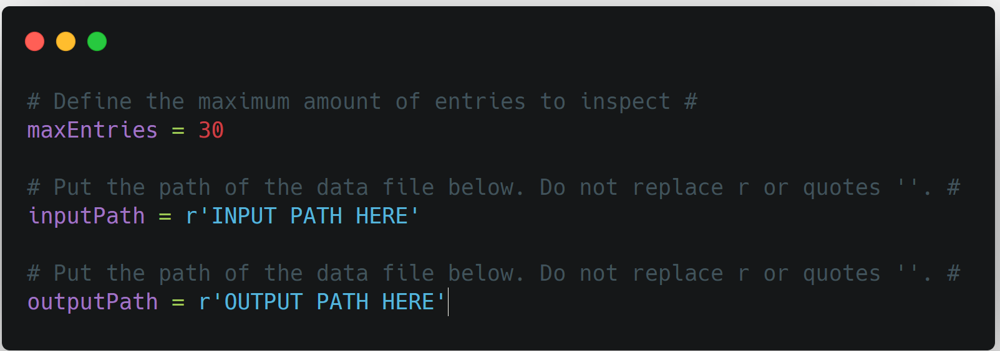

Next, we read in our input csv with the necessary columns

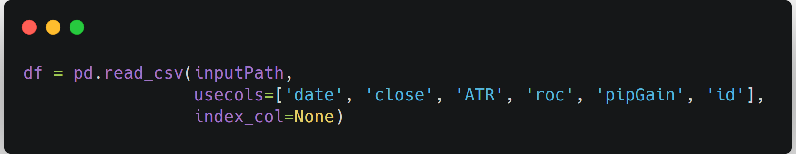

We'll need to calculate the max ID value in the 'id' DataFrame.  We do this
using the .loc method on the length of the DataFrame. 

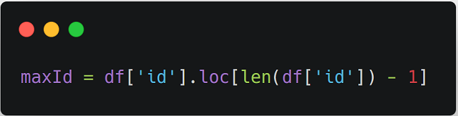

We want to be careful because the value we put for maxEntries may exceed the
actual maxID value.  For example, if our database may only have 29 entries, and
we want to return 30 values, we'll get an error because our program is
 looking for a 30th entry that doesn't exist.
   
We want to write a function that makes our maxEntries value equal our maxID value if
maxEntries is less than maxId.  That way, we just return what we have in our
 database and prevent our program from crashing.

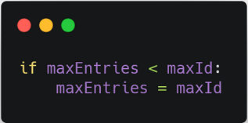
   
We're going to loop through the range of our entries.
First, lets create a list for the DataFrames we will return from our loop
 
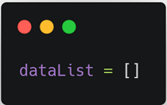

Our loop will cover the range of the latest 'x' amount of entries that we put
for our maxID value.  

As an example, lets say our DataFrame has 200 IDs, and
we limit our maxEntries to 30.

Because our database lists values in date ascending order (the furthest
away date to the most recent date), our largest ID value will be the most
recent range of dates, and the smallest ID will be the furthest range of
dates.  So we want to return the IDs from 170-200, because these are the 30
most recent ranges of dates, and put this in the dataList we created. 

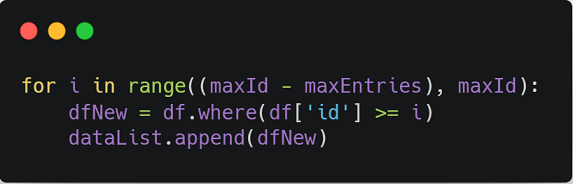

Now that those 30 DataFrames are saved in a list, we need to iterate over
each item in the list and return it to a separate sheet in our xlsx file.

[Andy Hayden on Stack Overflow](https://stackoverflow.com/a/14225838) has
provided a solution for a loop that works perfectly for our purposes
 
First, we'll define a function called save_xls that takes in two parameters
: the list of DataFrames, and the path for the output.  

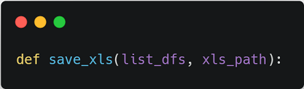

We're going to use a with statement next, so that we can streamline our code
by not repeatedly having to close and open each new spreadsheet.

The **.to_excel** method also allows us to write the provided DataFrame
object into a sheet.  However, if we want to write more than one sheet, we
will need to provide a specific ExcelWriter object. 
This is where the **ExcelWriter** that we imported comes into play.  
Excelwriter is a **class** in Pandas that enables us to write DataFrame
objects into sheets, and is what we will need to pass in to our .to_excel
 method later to write the multiple sheets we need. 
     
For now we're going to call ExcelWriter here and pass in the output path
 variable (xls_path), and use it as our **writer**
  
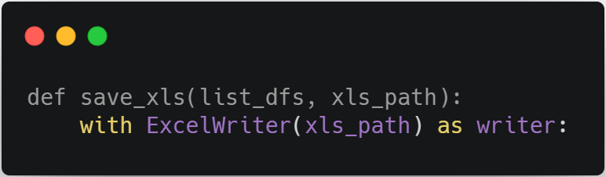
    
Next, we're going to use a **for** loop in which we will call the **enumerate
** method of our list of DataFrames.  

Enumerate takes all the values in a list and applies an index to it.  That
means for every item we have in the list, that index tells our program to which
sheet that data gets applied.

We're going to pass two variables into this enumerate function in our for loop:

1. a variable for the number of our index **n**
2. a variable for the DataFrame in our list **dfl** 

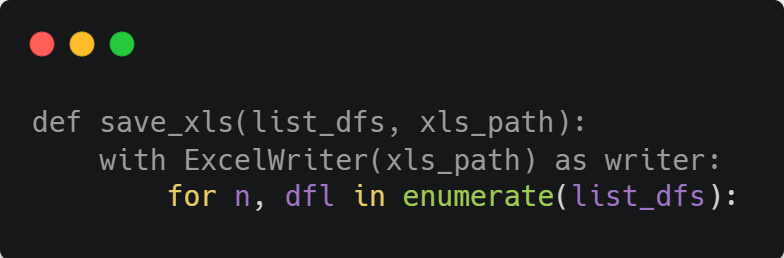

The enumerate method, by default, starts at index 0 and works our way up
.  Since our range is going to be 1 to whatever max value we provided, its
 better to start at index 1 for ease of reference.  We can pass the value 1
  as our second argument into enumerate to tell it to start at index 1.
  
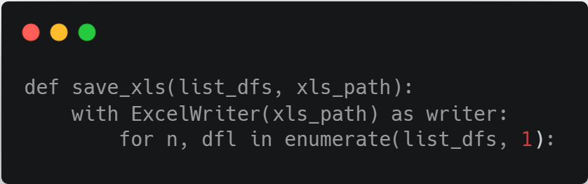
          
Each of these DataFrames will need to go into a separate sheet.  We need to
 pass in that **ExcelWriter** to save our multiple DataFrames.  Since this
  was provided as our writer, we can pass "writer" in here

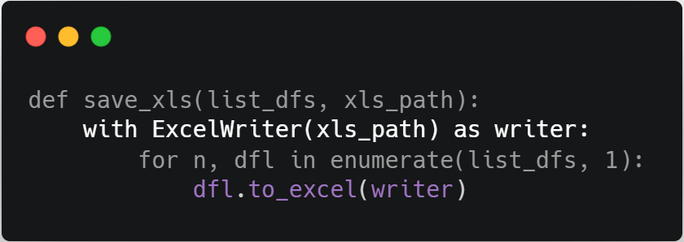

We also need to tell the program what the sheets will be named.  We'd like to
make it read "sheet" plus the index of our entry (sheet1, sheet2, etc), so we
'll provide **sheet%s** 

%s is a **string formatting syntax**, and basically acts as a placeholder.
Where we provide this %s, we add a % symbol after it with the value that
replaces the %s placeholder.

This is where we put the index number, our **n** variable

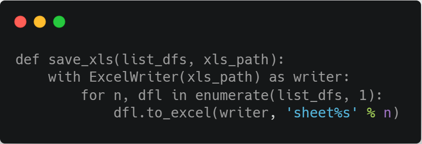
        
If we were to save this and return the output now, we'll find that there are
a lot of blank rows where the values from previous periods used to be.  We
would like to keep our data on the top row, and to do this we'll call the
 **.dropna** method, and only delete rows(axis=0) that are completely empty
  (how='all')

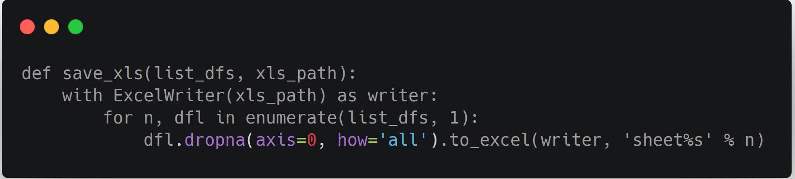
        
Now we can call .save on our writer to save our output.
       
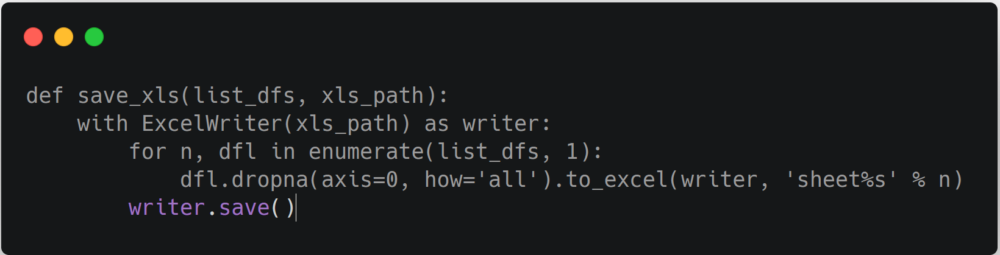

We finally call this save_xls function at the end to extract our data and
save it to our desired output path.
 
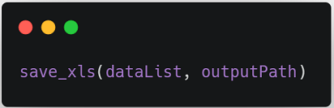

The full code is as follows:

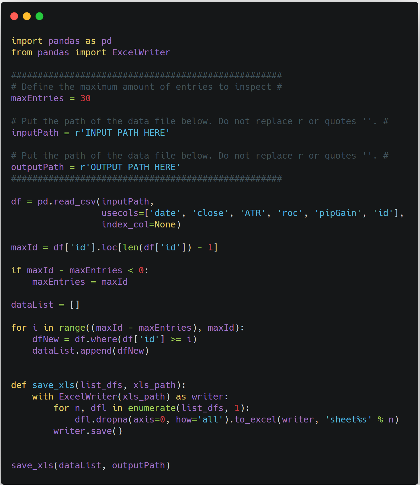

---
     
### Appendix 
#### Upcoming Plans

*Please note: This section contains various projects and ideas that will be
 changed as they are added, completed or removed.  Real-life
  obligations and technological constraints may affect the timeliness of how
   these are addressed, and if so will be edited with further details.*
   
- My trading algorithm follows the 
[No Nonsense Forex approach.](https://nononsenseforex.com/) This incudes six
 major components: 	
    1) ATR
	2) Baseline
	3) Confirmation Indicator
	4) Volume Indicator
	5) 2nd Confirmation Indicator
    6) Exit Indicator
    
    Each indicator that I am testing can function as one or multiple of these
     indicators, and some can function best only when used as multiple (for
      example, an Exponential Moving Average could function best as a
       Baseline **only when** it is also used as an Exit Indicator
       )  
       
     *Therefore, future modules should address these parameters and
      analyze
      not only what works best, but where it does relative to the algorithmic
       structure and to other indicators used in the algorithm.*
     
- News events impact trade entries and exits.  This structure is heavily
 trend-based, as we are looking for patterns in data to determine future
  actions. Consider the chart used in the example above:
  
  
  
  We can see an enormous red bar on January 3rd.  With no other context, we
   can only assume that either the AUD fell, the JPY rose, or both
    concurrently happened.  It is important to be contextually aware of these
     outliers when doing data analysis, as we can analyze other currency
      pairings with the same scrutiny and avoid including these outliers in
       data collection.
       
   It is important to understand that these phenomena can not always be
    explained.  The above situation is referred to as the 
    [Yen Flash Crash](https://www.cnbc.com/2019/01/03/yen-surges-against-global-currencies-after-flash-crash.html)
      and as we can see, even the experts don't have an exact reason as to
       why this particular situation occurred.
       
    *Modules should include a calendar of events where appropriate to account
     for outliers and detail the degree of influence and action taken.*
     
#### Citations

Andy Hayden on Stack Overflow:
https://stackoverflow.com/a/14225838 
for the code to save multiple sheets to an xlsx file.